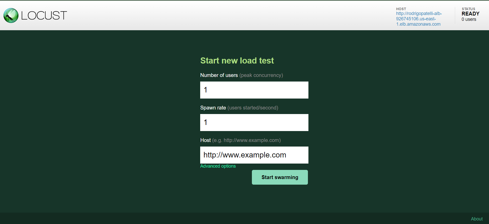
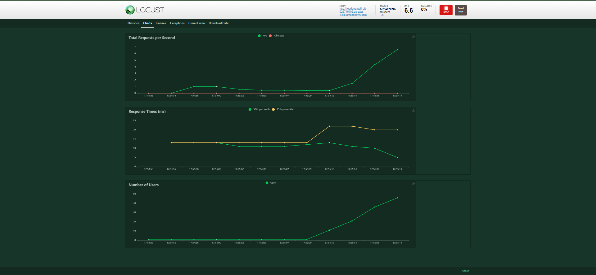
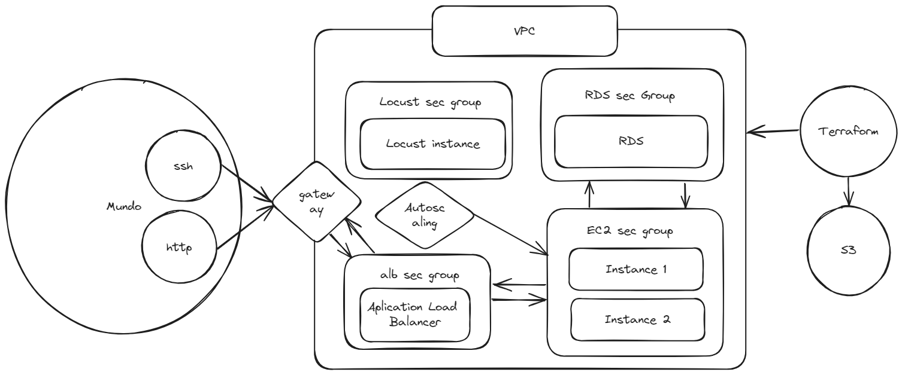

# Implementando uma arquitetura de nuvem com o AWS e Terraform

## Autor

<p align="justify">Rodrigo Anciães Patelli</p>

## Descrição do Projeto

<p align="justify">O projeto consiste em criar uma arquitetura de nuvem utilizando a AWS e Terraform. A arquitetura consiste em uma aplicação web que será executada em um servidor EC2, que por sua vez estará dentro de um Auto Scaling Group (ASG) e um Load Balancer (ELB) para distribuir a carga entre os servidores. A aplicação web será uma api RESTful com CRUD simples, que realiza acesso a um banco de dados. O banco de dados será executado em um servidor RDS.</p>


## Pré-requisitos

<p align="justify">Para executar o projeto é necessário ter instalado o Terraform e o AWS CLI. Para instalar o Terraform, basta seguir as instruções do site oficial: https://learn.hashicorp.com/tutorials/terraform/install-cli. Para instalar o AWS CLI, basta seguir as instruções do site oficial: https://docs.aws.amazon.com/cli/latest/userguide/install-cliv2.html.</p>

<p align="justify">Após a instalação do Terraform e do AWS CLI, é necessário configurar o AWS CLI com as credenciais de acesso da sua conta AWS. Para isso, basta executar o comando abaixo e seguir as instruções:</p>

```bash
aws configure
```


<p align="justify">Para executar o projeto, é necessário criar um par de chaves SSH. Para isso, basta executar o comando abaixo:</p>

```bash
ssh-keygen -t rsa -b 4096 -m pem -f exemplo
```

<p align="justify">O comando acima irá gerar um par de chaves SSH com o nome de exemplo. O arquivo exemplo será a chave privada e o arquivo exemplo.pub será a chave pública. Após a criação do par de chaves SSH, é necessário atualizar a variável public_key no arquivo ec2.tf com o nome da chave pública criada, conforme apresentado abaixo:</p>


<p align="justify">Após a criação da chave é necessário também criar um arquivo chamado secrets.tfvars com as informaçoes desejadas para o banco de dados. O arquivo secrets.tfvars deve conter as seguintes variáveis:</p>

```bash
db_host = "endereco_do_banco" # no nosso caso será 0.0.0.0
db_username = "usuario"
db_password = "senha"
db_name = "nome_do_banco"
```

<p align="justify">Após a criação do arquivo secrets.tfvars, é necessário executar o comando abaixo para inicializar o Terraform:</p>

```bash
terraform init
```

<p align="justify">Após a inicialização do Terraform, é necessário executar o comando abaixo para criar o plano de execução:</p>

```bash
terraform plan -var-file="secrets.tfvars"
```

<p align="justify">Após a criação do plano de execução, é necessário executar o comando abaixo para executar o plano de execução:</p>

```bash
terraform apply -var-file="secrets.tfvars"
```

<p align="justify">Após a execução do plano de execução, é necessário executar o comando abaixo para destruir a infraestrutura criada:</p>

```bash
terraform destroy -var-file="secrets.tfvars"
```

<p align="justify">Após a execução do comando acima, a infraestrutura será destruída.</p>

## Instruções extras de uso

### Locust

<p align="justify">Para utilizar o locust para testes de carga ´na aplicação é necessário somente, acessar a url que será exibida no final da execução do terraform apply. A url será semelhante a apresentada abaixo:</p>

```bash
http://ec2-3-236-253-241.compute-1.amazonaws.com:8089/
```
<p align="justify">Após acessar a url, basta preencher os campos conforme apresentado abaixo:</p>



<p align="justify">Após preencher os campos, basta clicar no botão Start Swarming e aguardar o resultado.</p>



<p align="justify">Observação: não colocar mais de 10 usuarios por segundo por preucação, pois o locust costuma ter erros quando se coloca muitos usuarios por segundo no começo da operação.</p>

### API

<p align="justify">A api utilizada neste projeto não foi feita por mim, mas é na verdade uma versão modificada da API de outra pessoa, para mais detalhes acesse o repositório em: https://github.com/RodrigoAnciaes/app_sql_megadados.git</p>


<p align="justify">Para utilizar a API, basta acessar a url que será exibida no final da execução do terraform apply. A url será semelhante a apresentada abaixo:</p>

```bash
http://ec2-3-236-253-241.compute-1.amazonaws.com:8080/docs
```

<p align="justify">Video explicativo da API: Link: https://youtu.be/gqzUmahmUUI</p>

## Tecnologias

<p align="justify">As tecnologias utilizadas foram:</p>

- Terraform
- AWS
- Locust
- AWS CLI
- AWS EC2
- AWS RDS
- AWS ALB
- AWS ASG
- AWS CloudWatch
- AWS S3 Bucket for Terraform State File
- AWS IAM
- AWS VPC


## Diagrama da Arquitetura



## Explicando as tecnologias utilizadas

### Terraform

<p align="justify">O Terraform é uma ferramenta de infraestrutura como código (IaC) que permite criar, alterar e melhorar a infraestrutura de forma segura e eficiente. O Terraform pode gerenciar provedores de serviços existentes e populares, bem como soluções internas personalizadas.</p>

### AWS

<p align="justify">A Amazon Web Services (AWS) é uma plataforma de serviços de computação em nuvem, que formam uma plataforma de computação na nuvem oferecida pela Amazon.com. Os serviços são oferecidos em várias geografias distribuídas pelo mundo.</p>

### Locust

<p align="justify">O Locust é uma ferramenta de teste de carga de código aberto. Ele é usado para medir o desempenho de um sistema sob uma carga de trabalho específica. Ele é usado para testar aplicativos, sites e APIs.</p>

### AWS CLI

<p align="justify">O AWS Command Line Interface (AWS CLI) é uma ferramenta unificada para gerenciar seus serviços da AWS. Com apenas uma única ferramenta para fazer o download e configurar, você pode controlar vários serviços da AWS a partir da linha de comando e automatizar tarefas por meio de scripts.</p>

### AWS EC2

<p align="justify">O Amazon Elastic Compute Cloud (Amazon EC2) é um serviço da web que fornece capacidade de computação redimensionável na nuvem. Ele foi projetado para facilitar a computação em nuvem na escala da web para os desenvolvedores.</p>

### AWS RDS

<p align="justify">O Amazon Relational Database Service (Amazon RDS) facilita a configuração, operação e escalonamento de um banco de dados relacional na nuvem. Ele fornece capacidade econômica e redimensionável para um aplicativo usando bancos de dados familiares do mercado de software.</p>

### AWS ALB

<p align="justify">O Application Load Balancer (ALB) é um balanceador de carga gerenciado pela AWS para aplicativos HTTP e HTTPS. O ALB opera em camada 7 e roteia o tráfego de entrada para alvos do Amazon EC2, contêineres do Amazon ECS e funções do AWS Lambda com base nas regras definidas pelo usuário.</p>

### AWS ASG

<p align="justify">O Auto Scaling Group (ASG) é um grupo de instâncias do Amazon EC2 que podem ser tratadas como uma unidade lógica para fins de dimensionamento automático e aplicação de políticas. Um ASG garante que o número especificado de instâncias do EC2 esteja sendo executado em todos os momentos.</p>

### AWS CloudWatch

<p align="justify">O Amazon CloudWatch é um serviço de monitoramento e observabilidade da AWS para recursos em nuvem e aplicativos executados na AWS. Você pode usar o Amazon CloudWatch para coletar e rastrear métricas, coletar e monitorar arquivos de log e definir alarmes. No caso deste projeto, o CloudWatch foi utilizado para monitorar o status do ASG e do EC2.</p>

### AWS S3 Bucket for Terraform State File

<p align="justify">O Amazon S3 é um serviço de armazenamento de objetos que oferece escalabilidade, disponibilidade de dados, segurança e desempenho líderes do setor. O S3 é projetado para armazenar objetos. Os objetos são arquivos individuais que podem variar em tamanho de 0 bytes a 5 TB.</p>

### AWS IAM

<p align="justify">O AWS Identity and Access Management (IAM) é um serviço da web que ajuda a proteger o acesso aos recursos da AWS. Ele permite que você controle quem pode usar os recursos da AWS (autenticação) e quais recursos eles podem usar e em quais condições (autorização).</p>

### AWS VPC

<p align="justify">O Amazon Virtual Private Cloud (Amazon VPC) permite provisionar uma seção logicamente isolada da nuvem da AWS onde você pode lançar recursos da AWS em uma rede virtual definida por você. Você tem controle total sobre seu ambiente de rede virtual, incluindo a seleção de seu próprio intervalo de endereços IP, criação de sub-redes e configuração de tabelas de rotas e gateways de rede.</p>

## Escolha da região

<p align="justify">A região escolhida para a execução do projeto foi US-east-1 (N. Virginia). A escolha da região foi feita com base no custo dos serviços. Considerando a natureza da aplicação CRUD simples, com estrutura focada em salvar dados, a escolha da região foi feita com base no custo dos serviços. A região US-east-1 (N. Virginia) é a região mais barata da AWS.</p>


## Calculo de custos

<p align="justify">Para calcular os custos da arquitetura, foi utilizado o AWS Pricing Calculator. O AWS Pricing Calculator é uma ferramenta que permite criar estimativas de custos para seus projetos na AWS. Para acessar o AWS Pricing Calculator, basta acessar o link: https://calculator.aws/#/.</p>

<p align="justify">A estimativas estão no seguinte arquivo:</p>

- [Estimativas de custos](EstimativasDeCustos.pdf)

<p align="justify">O custo levando em considerção o auto-scaling com máximo de máquinas está em:</p>

- [Custo com auto-scaling](EstimativasDeCustosAutoScalingMaximoDeMaquinas.pdf)

<p align="justify">O custo dos testes está em:</p>

- [Custo dos testes](CustosDosTestes.csv)

## Referências

<p align="justify">As principais referências utilizadas foram:</p>

- Terraform: https://www.terraform.io/
- AWS: https://aws.amazon.com/pt/
- Locust: https://locust.io/
- AWS CLI: https://aws.amazon.com/pt/cli/
- AWS EC2: https://aws.amazon.com/pt/ec2/
- AWS RDS: https://aws.amazon.com/pt/rds/
- AWS ALB: https://aws.amazon.com/pt/elasticloadbalancing/
- AWS ASG: https://aws.amazon.com/pt/autoscaling/
- AWS CloudWatch: https://aws.amazon.com/pt/cloudwatch/
- AWS S3 Bucket for Terraform State File: https://aws.amazon.com/pt/s3/
- AWS IAM: https://aws.amazon.com/pt/iam/
- AWS VPC: https://aws.amazon.com/pt/vpc/
- AWS Pricing Calculator: https://calculator.aws/#/


